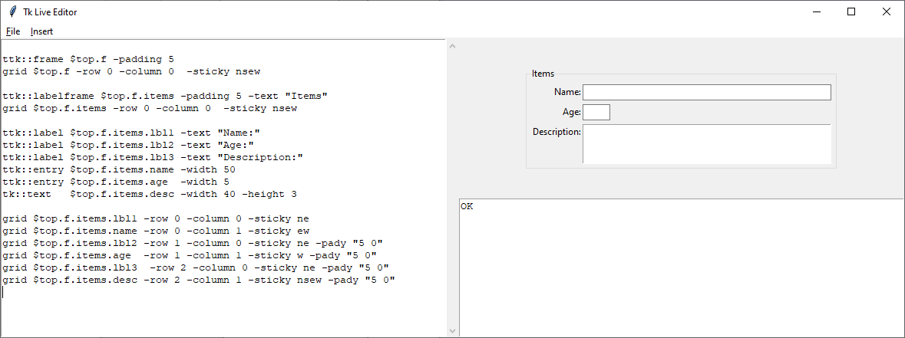

# liontk
a Python Tcl/TK GUI system that emphasizes direct direct use of tcl

created: 2021-10-22; last updated: 2021-10-27

## <a name="objectives">Project Objectives</a>

These are all the things that I want to do underneath the umbrella of this project:
* create & maintain tools
	* [liontk](#liontk) -- basic Python module for interacting with tcl/tk
	* [liontkcomposer](#liontkcomposer) -- a simple tool for composing tcl/tk GUIs very quickly
    * [liontkcomposer2](#liontkcomposer2) -- a more sophisticated tool for composing tcl/tk GUIs very quickly
	* [liontkref](#liontkref) -- a friendly and interactive reference, itself in tcl/tk + Python, for tcl/tk
* make the tools easily installable, via pip install
* [collect & publish articles](#articles)
	* what this is about (Python + tcl/tk, and in this particular way)
	* insights gained while working on this particular approach
* education & propaganda
	* provide pointers to quality tcl/tk programming resources
		* how to program tcl/tk
		* how to program tcl/tk in Python
		* specific tools
	* note the [programming philosophy](https://github.com/LionKimbro/lions_internet_office/blob/main/2021/users/lion/entries/2021-09-06_programming-philosophy.md) behind this project
	* promote [PySimpleGUI](https://pysimplegui.readthedocs.io/en/latest/), as well, even though it's different than this
	* invite people to [Lion's Internet Office](https://github.com/LionKimbro/lions_internet_office)

## <a name="liontk">liontk</a>

This is code... probably a framework, ... for working with tcl/tk code.
It works according to my fairly peculiar Python programming style, which is odd, but in accordance with my Philosophy.

status:
* I've uploaded the basic code, but it needs to be "productized" a bit, before it's fit for general consompution.
* "Productizing" here means:
	* It requires some documentation about some of the -- very atypical today -- programming patterns it makes use of.  (In fact, I think I need to create a general website about the programming ideas and patterns that I am exploring and making use of.)
	* It requires a conventional API documentation of core functionality.
	* It requires instructions about how to install and configure.

## <a name="liontkcomposer">liontkcomposer</a>

`tkcomposer` lets you write tcl/tk code directly in an edit window, and get automatic updates on what is produced on the side.

Here's a screenshot:

[(You can see more screenshots in this linked gallary that I made.)](articles/2021-10-23_tkcomposer-example-screenshots.md)

While there are features that I would like to add (specifically, a button or command that pops out your GUI into a toplevel window,) it is able to do the core functionality, and do it well.

It also features a menu full of example code, so you can select the code for a widget, insert it, and just edit it in the edit pane.  It dramatically speeds up development, because you don't have to look up options, unless they are unusual or weird ones.  Not all of the examples are written yet -- just most of them.

status:
* This is done and uploaded.  It's fully usable.
* Just download the git repository, step into the `tkcomposer/` directory, and run `python go.py`.
* Select "Insert | Frame" from the menu, and then "Insert | Button" or "Insert | Label", and away you go.

## <a name="liontkcomposer2">liontkcomposer2</a>

I am presently (2021-10-27) [working on tkcomposer2 -- oriented towards making much larger user interfaces than it is easy to do with tkcomposer1.](articles/2021-10-28_tkcomposer2-work.md)

Here's a screenshot:

## <a name="liontkref">liontkref</a>

(NOT STARTED YET)

I have long desired for there to be a tcl/tk program wherein you can construct tcl/tk commands, seeing all the options that are available, and documentation about what they mean, embedded all in the same place.  It'd be a "tcl/tk command construction kit," in a way.

Honestly, it baffles me that this doesn't exist yet.  Everybody needs to pass through this!  And if you had it, there'd be zero mystery about how to construct tcl/tk commands, or what to expect from them.

So I wouldn't consider this project "complete" without it.

## <a name="articles">Articles</a>

I wrote one article to introduce this project:
* [My Work with Python and Tcl/Tk GUIS](articles/2021-10-22_my-work-with-python-and-tcltk-guis.md) -- outlines the basic story of how I came to this particular way of working with Python and Tcl/Tk

I have two other articles worth noting here, though they are not strictly part of this project:
* [tkinter Direct Injection](https://github.com/LionKimbro/lions_internet_office/blob/main/2021/users/lion/entries/2021-09-18_tkinter-direct.md) -- the basic method of working directly with tcl/tk code, from Python
* [Programming Philosophy](https://github.com/LionKimbro/lions_internet_office/blob/main/2021/users/lion/entries/2021-09-06_programming-philosophy.md) -- particular elements of my philosophy of programming

## <a name="commitments">Commitments</a>

None.

I want to be clear:  Just because I structure my work, doesn't mean that it will be completed.  I start a lot of things, and only a tiny fraction of them reach a mature state.  That's okay with me -- I regularly see things reach maturity.  But the fraction is very low.  Still: *I structure my work*.  Just understand that structure != commitment.

I am not paid for this work; rather, I work on things opportunistically.  It often happens that I pick up a thread that I dropped say 8 years ago, because ideas stick with me for life, I have found.  I just follow the energy of enthusiasm wherever it takes me, for however long it takes me, and then drop it until it comes back.
