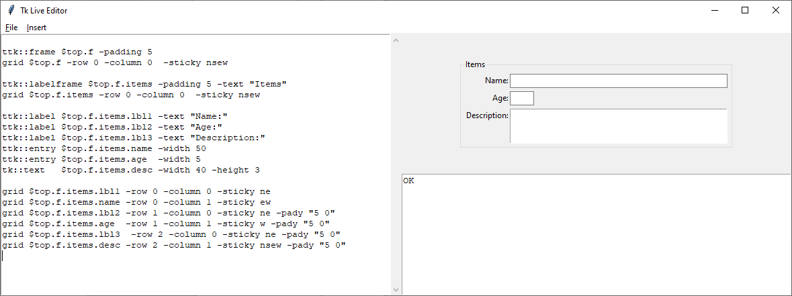
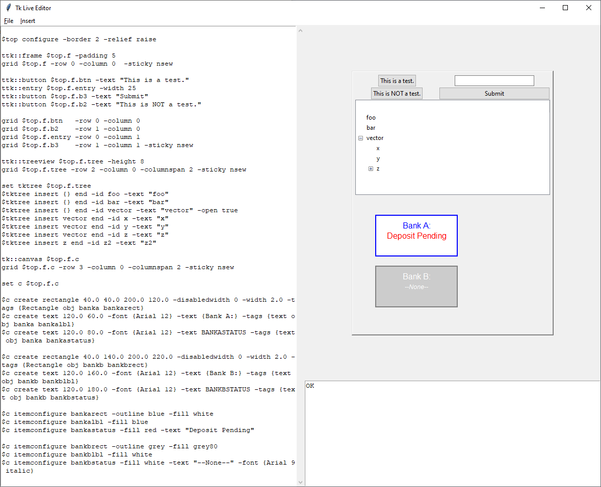

# liontkcomposer -- Example Screenshots

These are some screenshots from the tk composer.

## Japanese Text (漢字)

In this image, you can see some Japanese text.

I created a special style for this image, because if the Japanese text is too small, it's hard to read the 漢字.

## Simple Form Input

This is an example featuring some simple form input.

What I love about using this tool is seeing the instantaneous response;
When you change the "-width" parameter on the age, for example, you can see how the field changes in appearance.

I find this tool as valuable for learning how tcl/tk works, as it is for making user interfaces.

It's often easier to just try something out and see what it does, than to read a lot of documentation.

And with the snippets library, it's easy to find something done before, and look at how it works, than to try and make something from scratch.

## Complex Example incl. Schematics

This is a more complex example.

You can see the tree widget being used, and you can also see the canvas that has had material drawn into it.

Did I compose that by hand?  I did not!

I drew them in [tkpaint,](https://www.samyzaf.com/tkpaint.zip) which can save to a tcl file, and then transfered the drawing portion of that output directly into my program listing here.  (I just made a quick pit-stop in a text editor to search-and-replace ".c" to "$c", meaning that the output canvas was relocatable to any canvas object in my GUI.)
