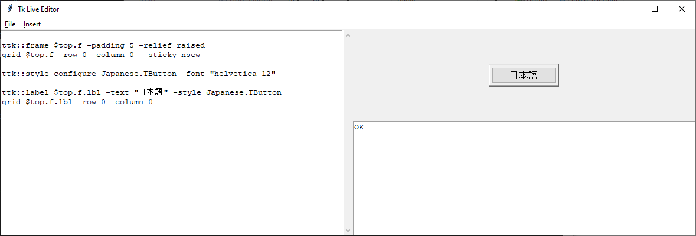

# liontkcomposer -- Example Screenshots

These are some screenshots from the tk composer.

## Japanese Text (漢字)

In this image, you can see some Japanese text.

I created a special style for this image, because if the Japanese text is too small, it's hard to read the 漢字.

## Simple Form Input

This is an example featuring some simple form input.

What I love about using this tool is seeing the instantaneous response;
When you change the "-width" parameter on the age, for example, you can see how the field changes in appearance.

I find this tool as valuable for learning how tcl/tk works, as it is for making user interfaces.

It's often easier to just try something out and see what it does, than to read a lot of documentation.

And with the snippets library, (more on that in a second,) it's easy to find something done before, and look at how it works, than to try and make something from scratch.

## Complex Example incl. Schematics

This is a more complex example.

You can see the tree widget being used, and you can also see the canvas that has had material drawn into it.

Did I compose that by hand?  I did not!

I drew them in [tkpaint,](https://www.samyzaf.com/tkpaint.zip) which can save to a tcl file, and then transfered the drawing portion of that output directly into my program listing here.  (I just made a quick pit-stop in a text editor to search-and-replace ".c" to "$c", meaning that the output canvas was relocatable to any canvas object in my GUI.)

## Using the Snippets Library

You don't have to start from scratch!

There's an embedded snippets library.

Do you need a button?

Just select "Insert | Button" from the menu, and you'll get the code for a button, and its gridding.  Edit it a little bit, and you'll have a button appearing on your page.

(If you're a total beginner and haven't quite understood the Tk widget hierarchy, [which you can learn about at tkdocs.com](https://tkdocs.com/tutorial/concepts.html#widgets), by the way, make sure you "Insert | Frame" first, before "Insert | Button", because the button places itself on that frame.)

At present, (2021-10-23,) there's some missing entries, but as I make more widgets, it will flesh out with more and more examples.  And I encourage you to fork the project and submit some examples of your own -- it's fairly straightforward to extend the menu.

If you are doing this fresh, insert one of the complete examples, ("Insert | Example" for instance,) and you can start tinkering right away.

