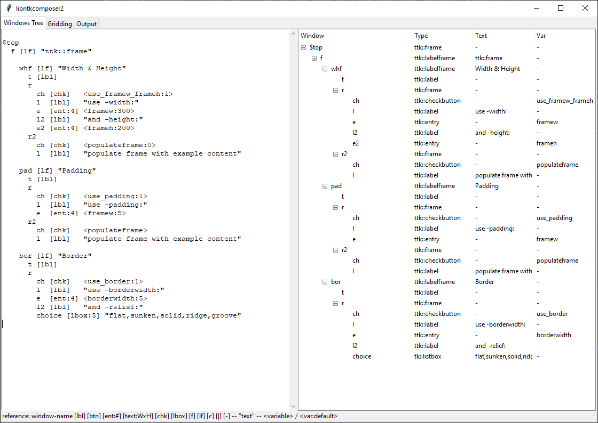

# liontkcomposer2 -- Notes on Development

2021-10-27

I'm presently working on "tkcomposer2".

## Background and Justification

I was working with [tkcomposer (the original)](2021-10-23_tkcomposer-example-screenshots.md), and realized, "Wow, it takes a LOT of legwork to create the user interface by hand, even with the advantage of snippet pasting."

For example, there are many laborious tasks such as:
* Making the ID names correctly -- they can get quite long, once you get three or four levels down the hierarchy.
* Keeping everything straight -- I found myself inserting lots of white space before arguments, so that I could conceptually understand what was going on.
* Hooking up scrollbars, and the scrollbar code.
* Trying to keep my gridding straight, what with the mass of text.

"I want a tool that takes a nice, short, tree-shaped input, and builds out everything in long form for Tcl/Tk."

I thought about making a data structure that would be interpreted, and then execute construction code on the back end.  And maybe that's a good idea.  But I think I prefer generating the output code for the time being, so that it can be manipulated very directly, rather than trying to debug some interpreter, or trying to hack some interpreter, when you want to do something a little differently than my code production process makes easy.

One of the problems that I have is that there's SO MUCH information associated with a widget, that it's a bit much for a single document.

So I decided to make a split between the layout code (the "gridding,") and the widget authoring code.  The widget authoring code authoritatively defines the widgets (or in Tk's language, the "windows,") and the layout code specifies everything about the positioning of the widgets.  That way, the separate parts of the code can refer to the separate roles.

I'm not done, but here's what I have so far.

## The Windows Tree

Here's what it looks like:



Here on the left, you can see the edit screen.  On the right, you see the parsed and arranged node hierarchy.


This is a small example.  Here you can also see some of the abbreviations.
For example, if you just put in a string, such as "This is a label.", it is automatically interpreted as a ttk::label.

The code there outputs:

```
ttk::frame $top
ttk::label $top.anon1 -text "This is a label."
ttk::button $top.b1 -text "A button." -command do_xyz
ttk::frame $top.f
ttk::label $top.f.anon2 -text "Name:"
ttk::entry $top.f.e1 -width 20 -textvariable name
```

## The Gridding Pane

The gridding tab is incomplete, -- it presently doesn't re-represent its understanding in the tabular output, but here is what I have so far:


When you click "Clear & Populate," it resets the text field with the full contents of the names of all IDs, collected from the current node model (which can be seen visualized on the Windows Tree pane.)

Then you just fill it out with coordinates.  `[0,0] <2,1> {nsew}` means: `-column 0 -row 0 -columnspan 2 -rowspan 1 -sticky nsew`

Those details will be visible in the (presently empty) tree on the right.

The output is presently partly implemented:

```
grid $top

grid $top.anon1 -row 0 -column 0 -sticky w
grid $top.b1 -row 1 -column 0 -sticky ew
grid $top.f -row 2 -column 0 -sticky ew

grid $top.f.anon2 -row 0 -column 0
grid $top.f.e1 -row 0 -column 1 -sticky nsew
```

However, the rowconfigure and columnconfigure are not implemented yet; that should be coming soon.

## The Output Pane

The Output panel isn't set up yet, and I'm still thinking about its layout.

It's critical to me to have a separate window (not a tab) that shows the current window, as it is set up, on a continuing basis, as you edit.


## Motivations

1. To get the practice and understanding of Tcl/Tk that will be necessary for the data editors and data visualization tools for the Entity Package work.
2. To make some tools that will make it feasible for one person (namely, me,) to do a great deal of user interface work, that will be needed for an ecology of tools around that Entity Package work.  A GUI builder that I like & respect will be critical to that work.
3. I just have found real love for the Tcl/Tk system.

